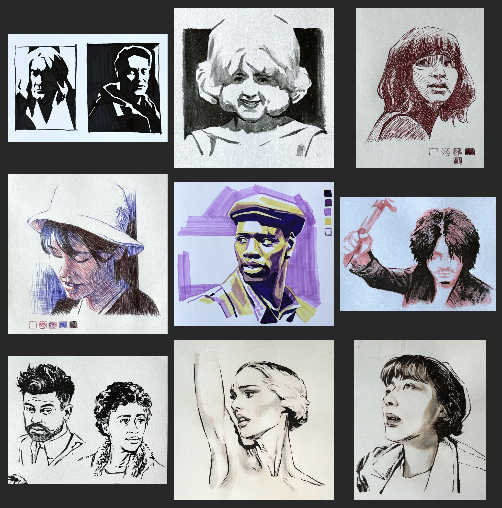

# collage-maker

## Overview
An app that allows a user to quickly generate an n-by-3 collage from their uploaded images. This was originally created to help artists create summary images of all their artwork submissions for a month-long drawing challenge. The collage is capped at 15 images for optimal presentation when shared on Discord, the platform where the challenge took place.

**Example:**

